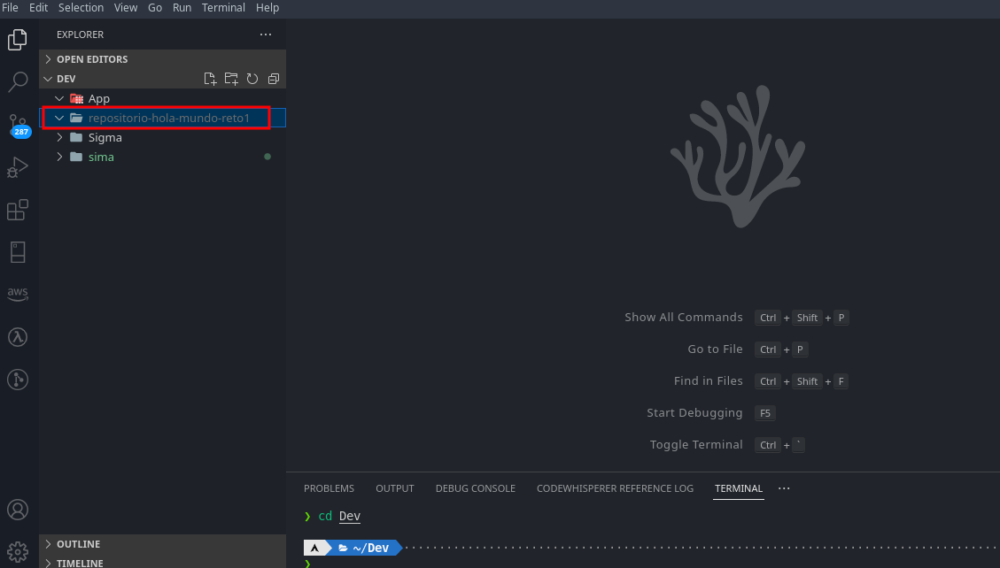
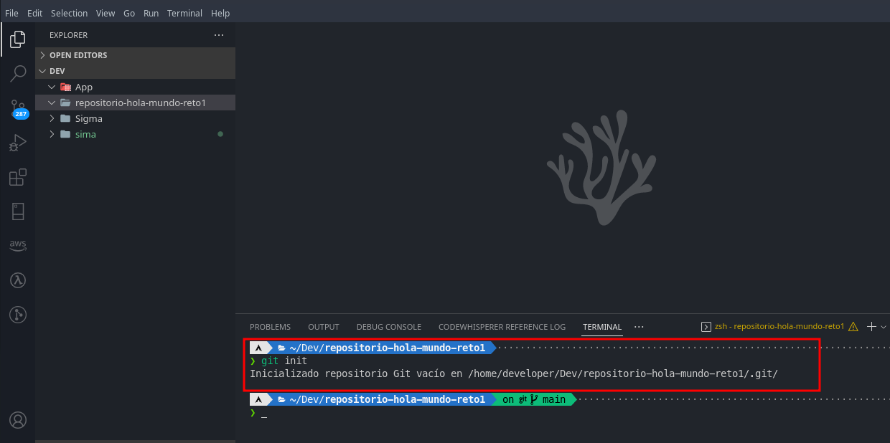
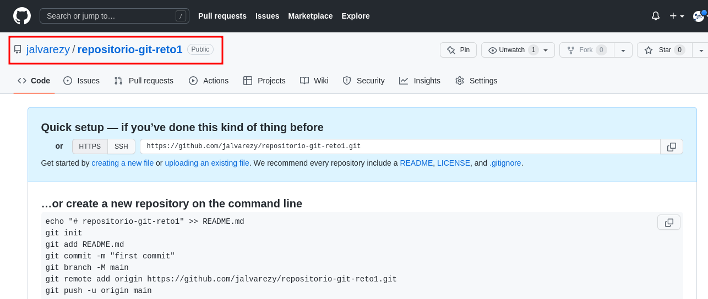
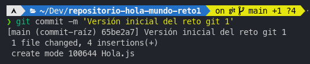
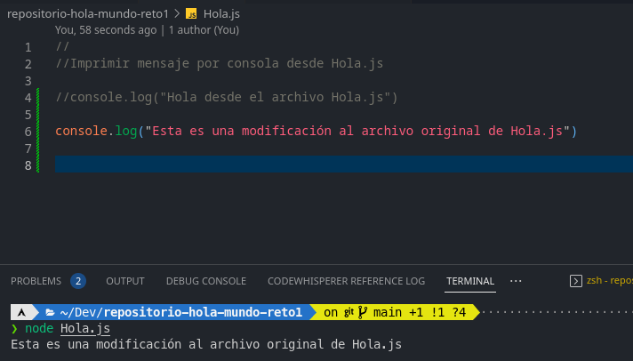
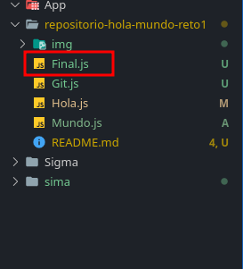
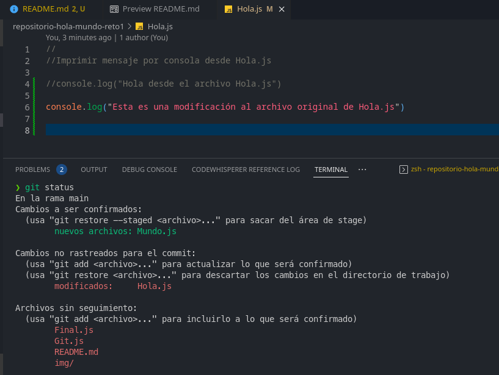

# Reto Git-01

## 1. Crear una carpeta llamada "repositorio-hola-mundo-reto1"

Se crea la carpeta que contendrá nuestro repositorio del reto.

## 2. Ejecutar dentro de la carpeta el comando "git init"

## 3. Desde github.com crear un repositorio llamado "repositorio-git-reto1"

## 4. Dentro de la carpeta repositorio -hola-mundo-reto1 crear 3 archivos:

* Hola.js
* Mundo.js
* Git.js

## 5. Registrar un mensaje por consola dentro de cada archivo

## 6. Agregar el archivo Hola.js al área de preparación

Para agregar el archivo al área de preparación ejecutamos el comando:

`git add Hola.js`

## 7. Revisar el estado de los archivos mediante el comando "git status" desde git bash

**¿Cúal es la diferencia entre los archivos?**

La diferencia es que  iniciamos el seguimiento del archivo Hola.js, paśo al área de *stage* y está esperando ser confirmado. Mientras que los archivos Git.js y Mundo.js no cuentan con seguimiento o no se ha iniciado el mismo hasta el momento.

**¿A qué se debe esta diferencia?**

La diferencia se debe a que indicamos el seguimiento únicamente del archivo Hola.js cuando ejecutamos el comando `git add Hola.js`

## 8. Confirmar el envío de los archivos preparados con un mensaje especifico

## 9. Agregar al área de preparación el archivo mundo.js

## 10. Al mismo tiempo se modifica el archivo Hola.js

## 11. Al mismo tiempo se agrega un archivo nuevo llamado Final.js  a la carpeta principal del repositorio

## 12. En el archivo Hola.js  se debe agregar un segundo mensaje

## 13. Revisar el estado del área de trabajo y describir lo que sucede

Se agregó Mundo.js a preparación, automaticamente se detecta que hubieron cambios en el archivo Hola.js que ya estaba siendo controlado o se le estaba haciendo seguimiento e informa que hay archivos 3 archivos (Final.js, Git.js y README:md) y una carpeta img los cuales no cuentan con seguimiento

## 14. Preparar los cambios y confirmarlos con un mensaje descriptivo

